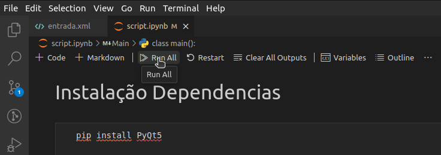

# 🚀 Transformada de viewport
Repositório dedicado ao Trabalho Prático da disciplina de Computação Gráfica

## 💻 Pré-requisitos
Todas as dependências são instaladas automáticamente pelos 'notebooks' do Jupyter, tais dependências são:

- PyQt5
  ```
  pip install PyQt5
  ```

## ☕ Usando a aplicação
> Utilizamos jupyter (python) para o desenvolvimento dessa aplicação. Para rodar o projeto usando a extensão do Jupyter no VS Code, basta clicar em *run all*




## 🤝 Colaboradores

<table>
  <tr>
    <td align="center">
      <a href="https://github.com/yodemisj" title="Yodemis Junior">
        <br>
        <sub>
          <b>Yodemis Júnior</b>
        </sub>
      </a>
      <br>
      contato: yjsn@aluno.ifnmg.edu.br
    </td>
    <td align="center">
      <a href="https://github.com/gabrielsizilio" title="Gabriel Sizilio">
        <br>
        <sub>
          <b>Gabriel Sizilio</b>
        </sub>
      </a>
      <br>
      contato: gms11@aluno.ifnmg.edu.br
    </td>
  </tr>
</table>
