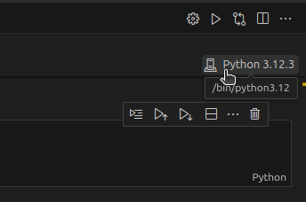
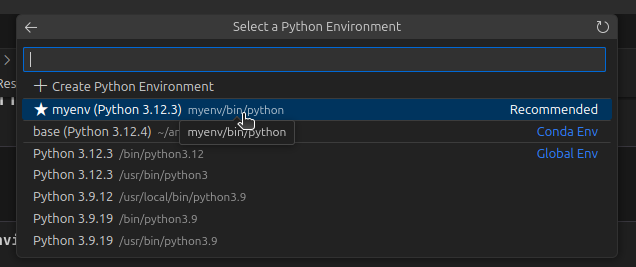

# 🚀 Transformada de viewport - part.1
Repositório dedicado ao Trabalho Prático (parte 1) da disciplina de Computação Gráfica

## 💻 Pré-requisitos
Todas as dependências são instaladas automáticamente pelos 'notebooks' do Jupyter, tais dependências são:

- PyQt5
  ```
  pip install PyQt5
  ```

## 🚨 Resolução do Erro externally-managed-environment
Se você encontrar o erro externally-managed-environment ao tentar instalar pacotes com *pip*, isso geralmente indica que você está em um ambiente gerenciado pelo sistema (por exemplo, um ambiente de sistema padrão onde você não tem permissões para instalar pacotes globalmente). Uma solução é criar um abiente virtual e instalar as dependencias por lá:

Linux:
```
python -m venv myenv
source myenv/bin/activate
```
Windows:
```
python -m venv myenv
myenv\Scripts\activate
```
Então você acabou de criar o ambiente virtual "myenv" e o ativou com "source myenv/bin/activate" (myenv/bin/activate no Windows). 

Basta Selecionar esse ambiente para instalar as dependências e rodar o projeto.

 

## ☕ Usando a aplicação
> Utilizamos jupyter (python) para o desenvolvimento dessa aplicação. Para rodar o projeto usando a extensão do Jupyter no VS Code, basta clicar em *run all*


## 🤝 Colaboradores

<table>
  <tr>
    <td align="center">
      <a href="https://github.com/yodemisj" title="Yodemis Junior">
        <br>
        <sub>
          <b>Yodemis Júnior</b>
        </sub>
      </a>
      <br>
      contato: yjsn@aluno.ifnmg.edu.br
    </td>
    <td align="center">
      <a href="https://github.com/gabrielsizilio" title="Gabriel Sizilio">
        <br>
        <sub>
          <b>Gabriel Sizilio</b>
        </sub>
      </a>
      <br>
      contato: gms11@aluno.ifnmg.edu.br
    </td>
  </tr>
</table>
